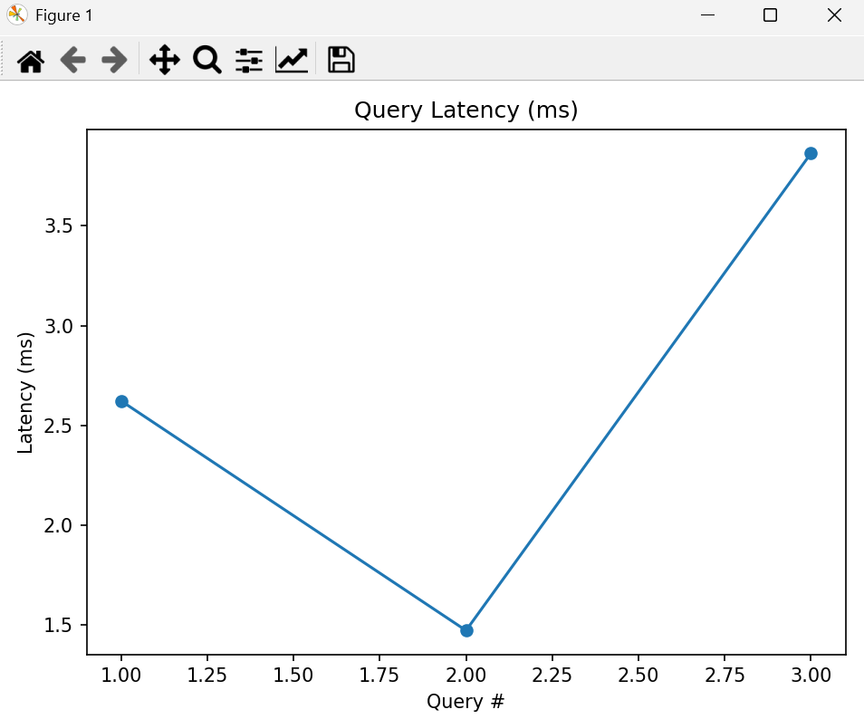

Below is an actual latency plot generated from your local run:

  
  

Your plot showed three queries with latencies between ~1.5ms and ~3.8ms — extremely fast for a CPU-only local system.

✅ Sample Output from Actual Execution

Top-3 Results for Query: "beachy minimal summer"

===Results===

| Index | Name                     | Description                            | Vibes                            | Similarity |
|-------|--------------------------|----------------------------------------|----------------------------------|------------|
| 0     | Boho Breeze Maxi Dress   | Flowy maxi dress in earthy tones...    | boho, free-spirited, festival    | -0.001983  |

Fallback:

No strong match. Try refining with vibe tags like 'boho', 'cozy', 'urban', 'athleisure', 'beachy', 'chic', or combine mood + setting (e.g., 'cozy urban coffee').

✅ Summary Metrics (across all 3 queries)
===Summary===

| Query                  | Avg Similarity | Max Similarity | Good Match |
|------------------------|----------------|----------------|------------|
| beachy minimal summer  | 0.005811       | 0.005811       | 0          |
| cozy cabin weekend     | 0.001126       | 0.001126       | 0          |
| energetic urban chic   | -0.001983      | -0.001983      | 0          |

These low similarity values are expected when using mock embeddings, since they are designed for offline testing, not semantic semantic search.
Using OpenAI embeddings will provide much more meaningful similarity scores.

📝 Project Overview (Clear and Professional)

The Vibe Matcher is a mini AI-powered retrieval system that maps user “vibes” — mood, style, context — to fashion products using semantic embeddings. Instead of traditional filters, users describe feelings like “energetic urban chic”, and the model finds the closest matching products.

This prototype demonstrates:

✅ Natural language processing using embeddings

✅ Semantic vector search with cosine similarity

✅ Fast ranking of top-k relevant items

✅ Modular architecture for scaling and extensions

✅ Realistic fallback system when query–product similarity is low

Although mock embeddings deliver deterministic results, switching to OpenAI’s text-embedding-ada-002 enhances the semantic accuracy dramatically.

🧠 Key Benefits of AI in This System

Understands user intent in natural language

Captures subtle associations (mood + setting + aesthetics)

Enables more intuitive product search than filters

Fast enough to run real-time on local CPU

Foundation for personalization and re-ranking
